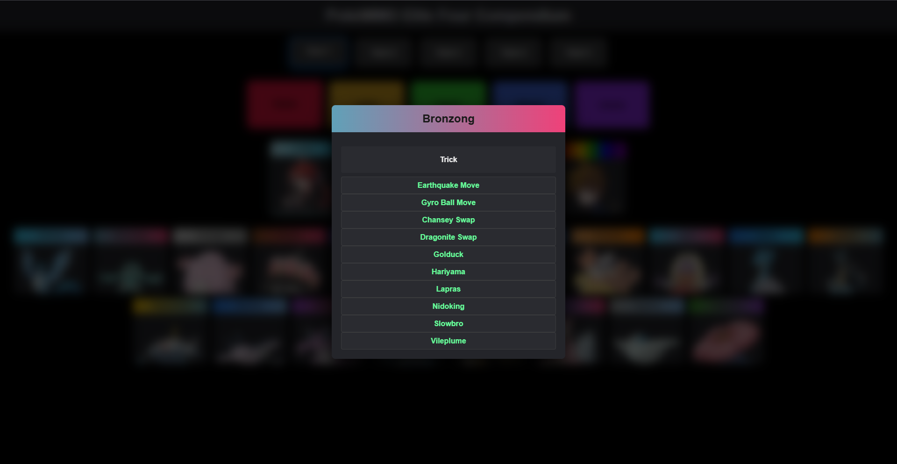

# 🏆 Pokemmo Elite 4 Compendium

An interactive and detailed guide to help players defeat the Elite Four in **Pokemmo**.
This site walks players step-by-step with tips, strategies, and suggested teams for each Pokémon League.

---

## ⚙️ Technologies Used

* [React](https://reactjs.org/)
* [Tailwind CSS](https://tailwindcss.com/) (installed, not yet in use)

---

## 📸 Screenshots

### 🌐 Frontend

#### 🏠 Homepage


---

#### 🔍 Pokémon Selection



---

## 📁 Project Structure

```bash
/pokemmo-elite4-compendium
├── /src
│   ├── /assets
│   ├── /components
│   │   ├── EliteMemberCard.jsx
│   │   ├── PokemonCard.jsx
│   │   ├── RegionCard.jsx
│   ├── /data
│   │   ├── eliteFourData.jsx
│   │   ├── pokemonColors.jsx
│   │   ├── pokemonData.jsx
│   │   ├── pokemonImages.jsx
│   │   ├── regionData.jsx
│   ├── App.css
│   ├── App.jsx
│   ├── index.css
│   └── index.jsx
├── tailwind.config.js
└── package.json
```

---

## 🔮 TODO

* [ ] Fully integrate Tailwind CSS for consistent and modern UI styling
* [ ] Develop full route coverage and strategic breakdowns for each region (Kanto, Hoenn, Sinnoh, Unova)
* [ ] Expand team options to accommodate diverse strategies and playstyles
* [ ] Add multilingual support (e.g., English, Italian) for broader accessibility

---

## ©️ Copyright

This project is **not open source**.
All content, code, and media are protected by copyright and may not be copied, modified, or distributed without explicit permission from the author.

---

## 📬 Contact

For questions, suggestions, or collaborations, feel free to reach out via GitHub.
