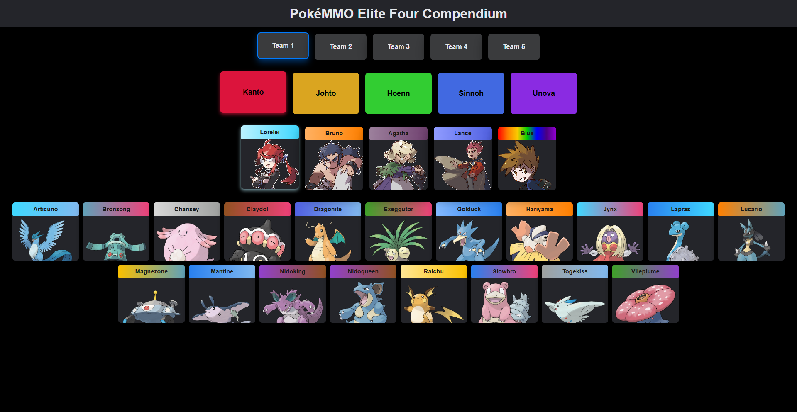

# 🏆 Pokemmo Elite 4 Compendium

Guida interattiva e dettagliata per affrontare e sconfiggere i Superquattro di **Pokemmo**.
Il sito accompagna passo dopo passo il giocatore con consigli, strategie e team suggeriti per ogni Lega Pokémon.

---

## ⚙️ Tecnologie usate

* [React](https://reactjs.org/)
* [Tailwind CSS](https://tailwindcss.com/) (installato, in fase di integrazione)
* Backend (specifica il linguaggio/framework se presente)

---

## 📸 Screenshot

### 🌐 Frontend

> *(Inserisci qui una o più immagini del frontend)*
> Esempio:
> 

### 🖥️ Backend

> *(Inserisci qui uno screen del backend se applicabile, anche in console o su Postman)*
> Esempio:
> 

---

## 📁 Struttura progetto

```bash
/pokemmo-elite4-compendium
├── /src
│   ├── /components
│   ├── /pages
│   ├── /assets
│   ├── App.jsx
│   └── index.js
├── tailwind.config.js
└── package.json
```
